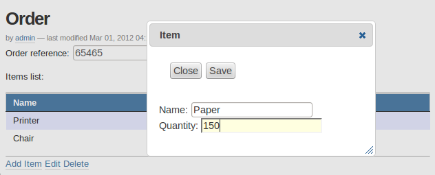

================
Fields reference
================

General parameters
==================

id
    :Value:
        Free text.

        It mustn't contain special characters or spaces.
    :Purpose:
        Field identifier. It is used in Plomino formulas to identify the
        corresponding document item.
Field type
    :Value:
        - Boolean
        - Datagrid
        - Date/Time
        - Doclink
        - File attachment
        - Google chart
        - Google visualization
        - Name
        - Number
        - Rich text
        - Selection list
        - Text
    :Purpose:
        Depending on the field type, the values entered in the field
        and/or the rendering of the field might be different. (See
        `Type-specific parameters`_.)
Field mode
    :Value:
        - Editable
        - Computed
        - Computed for display
        - Computed on creation
    :Purpose:
        When editable, a field value can be entered by the user.
        Otherwise, its value is computed using a formula. See
        :ref:`computed-fields`.
Formula
    :Value:
        Python code
    :Purpose:
        Depending on the field mode, this formula will compute the field
        value (if computed), or just its default initial value (if
        editable). **Note:** If the field is called using ``computeItem``,
        from some event or from some other field formula, the current field
        value will be overwritten even if it is an editable field.
Field read template and field edit template
    :Value:
        Page template id
    :Purpose:
        The custom ``.pt`` template to use to render the field. See
        :ref:`field-templates`.
Validation formula
    :Value:
        Python code
    :Purpose:
        The validation formula must return a string containing the error
        message if the validation failed, or an empty string is the
        validation was successful.
Add to index
    :Value:
        True/False
    :Purpose:
        If ``True``, the field is added to the database index, allowing to
        perform search on its values.
Index type
    :Value:
        ZCatalog index type
    :Purpose:
        Allow to define how the field must be indexed.
        If ``Default``, the field is indexed using the index type associated
        with its type.

Field indexing
==============

Plomino allows you to find documents according their field values when those fields
are indexed.
Search can be performed using a ``search form`` (see related paragraph) or
programmatically using the ``dbsearch`` method::

    db = context.getParentDatabase()
    results = db.getIndex().dbsearch({
                    'Form': 'frmEmployee,
                    'employee_department': 'HR'},
                    sortindex='employee_name')

Note: ``sortindex`` is optionnal.

The search behaviour depends on the index types.
Zope/Plone offers a standard set of indexes, and the most common ones are:

``FieldIndex``
    :Behaviour:
        - it accepts any type of values (text, dates, list, numbers, ...)
        - it matches exact values,
        - it allows sorting.
    :Example:
        If the field value is 'Jack London', it will match if we search
        for 'Jack London', but not if we search for 'Jack'.

``DateIndex``
    :Behaviour:
        - it handles date values in a more efficient way than FieldIndex,
        - it allows sorting,
        - it allows to search using a time interval.
    :Examples:
        Equality: ``db.getIndex().dbsearch({'EventDate': Now()+10})``
        Before: ``db.getIndex().dbsearch({'EventDate': {'query': Now(), 'range': 'max'}})``
        After: ``db.getIndex().dbsearch({'EventDate': {'query': Now()-7, 'range': 'min'}})``
        Interval: ``db.getIndex().dbsearch({'EventDate': {'query': [Now(), Now()+10], 'range': 'min:max'}})``

``ZCTextindex``
    :Behaviour:
        - it indexes text, and can match any contained word,
        - it does not allow sorting,
        - it allows wildcards and logical operator,
        - it ignores non-meanningful words (like 'the', 'a', 'is', etc.).
    :Example:
        If the field value is 'Jack London was here a long time ago', it will
        match if we search for:
            - 'Jack London',
            - 'Jack AND time',
            - 'London AND NOT Paris',
            - 'Lond*'.

``KeywordIndex``
    :Behaviour:
        - it indexes lists, and match their values,
        - it does not allow sorting.
    :Example:
        If the field value is ``['Austerlitz', 'Iena', 'Waterloo']``, it will
        match if we search for:
            - ``'Austerlitz'``,
            - ``['Iena', 'Austerlitz']``,
            - ``{'query': ['Austerlitz', 'Agincourt'], 'operator': 'OR'}``

All the Plomino field types are associated to a default index type:

- Text: ``FieldIndex``,
- Number: ``FieldIndex``,
- Rich text: ``ZCTextIndex``,
- Date/Time: ``DateIndex``,
- Name: ``FieldIndex``,
- Selection list: ``KeywordIndex``,
- File attachment: ``ZCTextIndex``,
- Doclink: ``KeywordIndex``.

The default index type can be changed using the ``Index type`` parameter,
but doing so might produce side-effects 
(for instance if the field was used to sort views or search results,
and its type is changed to a non-sortable index, this will break sorted
views).

Type-specific parameters
========================

Type-specific parameters are available in the field's :guilabel:`Settings`
tab:

.. image:: images/7ef734a8.png

Text field
----------

.. image:: images/3fdf9792.png

Widget
    :Value:
        - ``Text``
        - ``Long text``
    :Purpose: Text is rendered as a basic HTML input text field.
Size
    :Value: Integer
    :Purpose:
        - If "Text widget": input text size.
        - If "Long text": textarea rows.

.. image:: images/m1f045a32.png

Boolean field
-------------

No specific parameters.

Displays as a checkbox, and stores True or False.

Selection list field
--------------------

Widget
    :Value: - ``Selection list``
            - ``Multi selection list``
            - ``Checkboxes``
            - ``Radio buttons``
    :Purpose: Note: multi selection list and checkboxes are multi-valued.
Selection list
    :Value: List of strings
    :Purpose:
        The possible values selectable in the field.

        Note: if a value contains a pipe (``|``), Plomino uses the string
        *before* the pipe as the entry label, and the string *after* as the
        real value.

        Example: ``United states of America|USA``
Selection list formula
    :Value: Python script
    :Purpose:
        The formula must return the list of values selectable in the
        field (using the ``label|value`` format if necessary).

        Note: if a Selection list formula is provided, it overrides the
        Selection list to provide the field value list.
Separator
    :Value: String
    :Purpose:
        Used to separate the values in read mode for multi-valued fields
        and also in edit mode for radio buttons and checkboxes.

        Default is blank.

        Examples: ``;-,``


Name field
----------

.. image:: images/m608450e8.png

Type
    :Value:
        - ``Single valued``
        - ``Multi valued``
Separator
    :Value: String
    :Purpose:
          Used to separate the values in read mode.

          Default is blank.

          Examples: ``;-,``


.. _number-field:

Number field
------------

.. image:: images/m22b77a8c.png

Type
    :Value:
        - ``Integer``
        - ``Float``
Size
    :Value:
        Integer
    :Purpose:
        Length of the HTML input.


Date/Time field
---------------

.. image:: images/m3e60ec56.png

Format
    :Value:
          Python date pattern
    :Purpose:
          Example: ``%d/%m/%Y``

          If empty, default to the Database default date format.
Starting year
    :Value:
          Integer
    :Purpose:
          Earliest year selectable using the date/time widget.

          If empty, default to the Plone site default starting year.


File attachment field
---------------------

No specific parameters.

A file attachment field involves both a document item and a file. 
The item is named for the field and is set to a dictionary 
``{filename: contenttype}`` when edited through the web.

When dealing with attachment fields in formulas, both the item and the file
need to be managed. For example::

    i = 'itemname'
    filename, contenttype = doc.setfile(
            myfile,
            filename='%s.csv'%i,
            overwrite=True)
    doc.setItem(i, {filename: contenttype}) 

For a multi-valued field, this would be::

    i = 'itemname'
    filename, contenttype = doc.setfile(
            myfile,
            filename='%s.csv'%i,
            overwrite=True)
    doc.setItem(i, doc.getItem(i).update({filename: contenttype})) 

The same goes for deleting files (use the ``deletefile`` API).

Rich text field
---------------

No specific parameters.

Doclink field
-------------

.. image:: images/m78a38b08.png

Widget
    :Value:
        - ``Selection list``
        - ``Multi-selection list``
        - ``Embedded view``
    :Purpose:
          If :guilabel:`Embedded view` is selected, the view itself is
          displayed, with a check box on each row to allow the user to
          select a document.
Source view
    :Value:
          The targeted view
Label column
    :Value:
          The column used to provide the list labels
    :Purpose:
          Only apply if Selection list or Multi selection list
Documents list formula
    :Value:
          Python script
    :Purpose:
          This formula must return a list of string values formatted as
          follows: ``label|path_to_document``

          Notes:

          - it might a path to any kind of Plone object (even if the *main*
            purpose is to link to Plomino Documents),
          - if a formula is provided, it overrides Source view and Label
            column.
Separator
    :Value:
          String
    :Purpose:
          Used to separate the links in read mode.

          Default is blank.

          Examples: ``;-,``

Datagrid field
--------------

A datagrid field allows to edit a table. Rows are edited using an associated
form (displayed in a pop-up) in which fields are mapped to columns.



Associated form
    :Value:
        String
    :Purpose:
          Id of the form to use to add or modify row content.
Columns/fields mapping
    :Value:
          List separated with commas (with no space).
    :Purpose:
          Field ids of the associated form sorted according the columns
Javascript settings
    :Value:
          Javascript
    :Purpose:
          JQuery Datatables parameters

.. image:: images/datagrid-settings.jpg

Example: hide a column in a view
````````````````````````````````

You can hide a column in a view by changing the :guilabel:`Dynamic Table
Parameters` field to include something like::

    'aoData': [{"bVisible": false}, null, null, null]

You would need one item in the array for each column in the table.


Google chart field
------------------

Allow to draw static charts (or maps, etc.).

Example
```````

create a "Computed for display" Google chart field, and enter the following
formula::

    cost = 75
    margin = 25
    return {
        'chd': 't:%s,%s' % (str(cost),str(margin)),
        'chs': '250x100',
        'cht': 'p3',
        'chl': 'Cost|Margin'
        }

.. image:: images/google-chart.jpg

See `Google chart reference <http://code.google.com/intl/fr/apis/chart/>`_.

.. todo:: TO BE COMPLETED

Google visualization field
--------------------------

Allow to draw dynamic charts (or maps, etc.).

.. image:: images/gviz-piechart.jpg

.. image:: images/gviz-densitymap.jpg

.. todo:: TO BE COMPLETED
